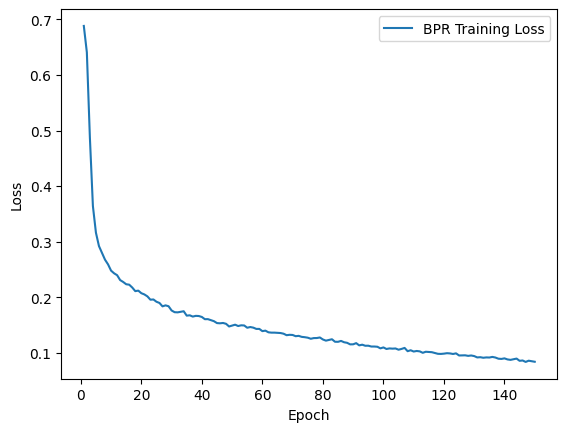
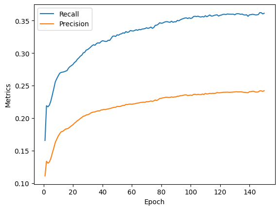

# Movie Recommender System with use of GNN

## Student information
* Name: Viktor Kovalev
* Innopolis email: vi.kovalev@innopolis.university
* Group: BS21-DS-02

## Navigator
 [Instalation](#instalation)

 [How to use](#how-to-use)

 [Metrics](#metrics)


## Instalation
Repository was tested only on Windows, therefore, may not work on Linux.

1. Clone repository
```console
git clone https://github.com/blueberry13-8/movie-recommender-system.git
```
2. Create and activate virtual environment
```console
cd movie-recommender-system
```
```console
python -m venv .venv
```
```console
.venv\Scripts\activate
```
3. Install dependencies

```console
pip install pandas
```

```console
pip install torch --index-url https://download.pytorch.org/whl/cu118
```

```console
pip install torch-scatter -f https://data.pyg.org/whl/torch-2.1.0+cu118html
```

```console
pip install torch-sparse -f https://data.pyg.org/whl/torch-2.1.0+cu118.html
```

```console
pip install git+https://github.com/pyg-team/pytorch_geometric.git
```

## How to use

Run the recommendation script with the required arguments:
```console
python ./benchmark/evaluate.py [model_path] [edge_index_path] [prediction_type] --user_id --latent_dim --num_layers
```

**model_path** - path to model weights

**edge_index_path** - path to edge indexes from training

**prediction_type** - can be `single` or `multiple`

**--user_id** - specify when use `single` type

**--latent_dim** and **--num_layers** - for your custom model

Here is example for `single`:
```console
python ./benchmark/evaluate.py ./models/model.pth ./data/interim/edge_index.pth single --user_id 2
```

And for `multiple`:
```console
python ./benchmark/evaluate.py ./models/model.pth ./data/interim/edge_index.pth multiple
```


## Metrics

Loss:



Metrics:



Example of recommendation:


Movies from test:


