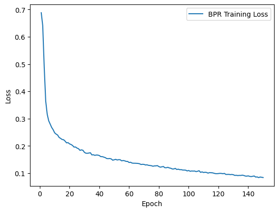
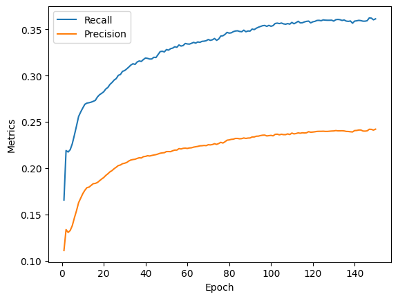
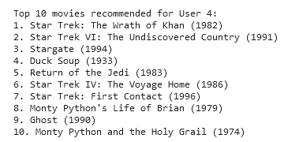

# Introduction

The objective of this assignment is to design and implement a robust recommender system for movies.  The primary model employed in this solution is LightGCN, and the Bayesian Personalized Ranking (BPR) loss serves as the criterion for training. The objective of this task is to recommend movies to users based on their list of favorite movies (identified by movie ids). To achieve this, a single machine learning model, LightGCN, has been chosen to address the recommendation challenge. To assess the efficacy of the recommender system, a benchmark has been established. This benchmark utilizes two key metrics – Recall@20 and Precision@20 – widely recognized in the evaluation of recommender systems.

# Data Analysis

The MovieLens100k dataset forms a bipartite graph comprising 943 users and 1682 movies. Both user and movie nodes are associated with specific features, while the edges represent user interactions with movies, indicating the rating given by the user.

## Rating Distribution


To tailor our recommendations to users' preferences, we filter out edges with ratings of 1 and 2, focusing on movies that are more likely to be enjoyed by the users.

## Sorted Number of Ratings Per User


A notable observation is that a substantial portion of users tend to watch a relatively small number of movies.

## Users' Age Distribution


The age distribution of users reveals a concentration of users between the ages of 20 and 35.

## Users' Occupation Distribution


The distribution of users' occupations indicates a significant proportion of students among the user base.

## Movies' Genre Distribution


Examining the genre distribution of movies, it's evident that genres like drama and comedy are predominant in the dataset.


# Implementation Details

The recommender system model is implemented as a Graph Neural Network (GNN) using PyTorch Geometric. Below are the key components of the implementation:

## Embedding Layer

The model utilizes an embedding layer to combine user and item embeddings into a single embedding matrix. The embeddings are initialized with a normal distribution, with a standard deviation of 0.1.

```python
self.embedding = nn.Embedding(num_users + num_items, latent_dim)
```

## Graph Convolutional Layers

The core of the GNN architecture employs Light Graph Convolution (LGConv) layers, which are instances of the torch_geometric.nn.LGConv class. These layers perform graph convolutions and capture the collaborative filtering relationships between users and items.

```python
self.convs = nn.ModuleList([LGConv(latent_dim) for _ in range(num_layers)])
```

## Forward Pass

The forward pass of the model takes the edge index of the bipartite graph as input and computes embeddings for users and items. The intermediate embeddings at each graph convolutional layer are stored in a list and aggregated by taking their mean.

```python
def forward(self, edge_index):
    emb0 = self.embedding.weight
    embs = [emb0]

    emb = emb0
    for conv in self.convs:
        emb = conv(x=emb, edge_index=edge_index)
        embs.append(emb)

    out = torch.mean(torch.stack(embs, dim=0), dim=0)

    return emb0, out
```

## Mini-batch Encoding

The model provides a method for encoding mini-batches of data, taking users, positive items, negative items, and the edge index as inputs. The embeddings for users, positive items, and negative items, both after processing and at the initial stage, are extracted and returned.

```python
def encode_minibatch(self, users, pos_items, neg_items, edge_index):
    emb0, out = self(edge_index)

    user_emb, pos_item_emb, neg_item_emb = out[users], out[pos_items], out[neg_items]
    user_emb0, pos_item_emb0, neg_item_emb0 = emb0[users], emb0[pos_items], emb0[neg_items]

    return user_emb, pos_item_emb, neg_item_emb, user_emb0, pos_item_emb0, neg_item_emb0
```

# Model Advantages and Disadvantages

## Advantages

1. **Graph-based Representation Learning:** The use of Light Graph Convolution (LGConv) allows the model to capture collaborative filtering relationships within the bipartite graph of users and items. This enables the model to learn rich representations that reflect user-item interactions.

2. **Embedding Layer:** The embedding layer efficiently combines user and item information into a unified embedding matrix, providing a compact representation of users and items in the latent space.

3. **Flexibility and Customization:** The model architecture is designed to be flexible, allowing the adjustment of latent dimensions, the number of layers, and other hyperparameters. This adaptability makes it suitable for experimentation and fine-tuning to specific datasets.

## Disadvantages

1. **Limited Exploration of Non-Graph Features:** The model primarily focuses on graph-based representations and might not fully exploit non-graph features such as demographic information. Incorporating additional features could enhance the model's understanding of user preferences.

2. **Sensitivity to Hyperparameters:** While the model offers flexibility in hyperparameter tuning, it may require careful optimization, especially regarding the number of layers and latent dimensions. Suboptimal choices may impact the model's performance.

3. **Sparse Data Handling:** The model's effectiveness may be affected by sparse user-item interactions, common in recommendation systems. Strategies for handling sparsity, such as incorporating additional information or employing specialized loss functions, may be necessary.

4. **Limited Interpretability:** GNNs, in general, are known for their complex, black-box nature. Understanding the exact reasoning behind specific recommendations may be challenging, potentially limiting the model's interpretability.

In summary, the model demonstrates strengths in graph-based learning and flexibility but comes with challenges related to handling non-graph features, sensitivity to hyperparameters, sparse data scenarios, and interpretability.

# Training Process

The training process involves BPR loss. After each epoch performed evaluation.


Within each epoch, it divides the training data into mini-batches. The BPR loss is computed based on the embeddings of users, positive items, and negative items obtained from the model's `encode_minibatch` method.

```python
for epoch in tqdm(range(epochs)):
    n_batch = int(len(train_df) / batch_size)
    bpr_loss_list = []

    model.train()
    for batch_idx in range(n_batch):
        optimizer.zero_grad()

        users, pos_items, neg_items = data_loader(train_df, batch_size, n_users, n_items)
        users_emb, pos_emb, neg_emb, userEmb0, posEmb0, negEmb0 = model.encode_minibatch(users, pos_items,
                                                                                          neg_items, train_edge_index)

        bpr_loss = compute_bpr_loss(users_emb, pos_emb, neg_emb)

        bpr_loss.backward()
        optimizer.step()

        bpr_loss_list.append(bpr_loss.item())
```

After each epoch, calculating recall and precision metrics on the test set, providing insights into the model's ability to recommend relevant items.
```python
model.eval()
with torch.no_grad():
    _, out = model(train_edge_index)
    final_user_Embed, final_item_Embed = torch.split(out, (n_users, n_items))
    test_topK_recall, test_topK_precision = get_metrics(
        final_user_Embed, final_item_Embed, n_users, n_items, train_df, test_df, K
    )
```

# Evaluation

The evaluation process is a crucial aspect of assessing the performance of the recommender system model. The `train_and_eval` function incorporates evaluation metrics, including recall and precision, to gauge the effectiveness of the model in recommending relevant items.

## Evaluation Metrics

### Recall

Recall is a metric that measures the proportion of relevant items that are successfully recommended by the model. In the context of the recommender system, it answers the question: "Out of all the items that the user should have seen, how many did the model actually recommend?"

### Precision

Precision is a metric that assesses the accuracy of the recommended items. It calculates the proportion of recommended items that are truly relevant. In the context of the recommender system, precision answers the question: "Out of all the items recommended by the model, how many were actually relevant to the user?"

## Top-K Evaluation

The evaluation is performed using a Top-K approach, where the model's recommendations are compared to the ground truth, considering only the top K items. This approach is particularly relevant in recommendation systems where users are typically interested in a limited number of items.

## Tracking Metrics
The function records BPR loss, recall, and precision for each epoch, providing a comprehensive view of the model's training and evaluation performance.
```python
bpr_loss_list_epoch.append(round(np.mean(bpr_loss_list), 4))
recall_list.append(round(test_topK_recall, 4))
precision_list.append(round(test_topK_precision, 4))
```

These metrics collectively form a comprehensive picture of the model's performance, allowing for analysis and comparison between different training epochs or variations of the model architecture.

# Results

The training process yielded a satisfactory result, with the loss converging to approximately 0.08. While the loss is a fundamental metric for training optimization, it's complemented by additional evaluation metrics.



The precision metric achieved a value of 0.2421, indicating the model's accuracy in recommending relevant items. Additionally, the recall metric reached 0.3623, reflecting the model's effectiveness in capturing a substantial portion of relevant items.



Examining the model's predictions for a specific user provides a tangible illustration of its capabilities.



Furthermore, exploring movies watched by a user that the model was not aware of showcases areas for potential improvement and opportunities to enhance recommendation coverage.


These visualizations and metrics collectively provide insights into the model's performance, offering a comprehensive overview of its recommendation accuracy and highlighting areas for refinement in future iterations.